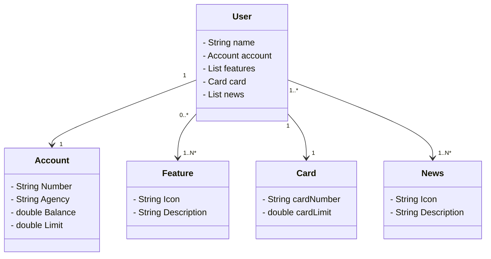

#Santander-dev-bootcamp-2023
API RESTful API desenvolvida durante o bootcamp santander 

## Diagrama de Classes

```mermaid
classDiagram
  class User {
    - String name
    - Account account
    - List<Feature> features
    - Card card
    - List<News> news
  }

  class Account {
    - String Number
    - String Agency
    - double Balance
    - double Limit
  }

  class Feature {
    - String Icon
    - String Description
  }

  class Card {
    - String cardNumber
    - double cardLimit
  }

  class News {
    - String Icon
    - String Description
  }

  User "1" --> "1" Account
  User "0..*" --> "1..N*" Feature
  User "1" --> "1" Card
  User "1..*" --> "1..N*" News
```
